 # AdWeb 广告管理平台 - 系统图表文档

本文档提供 AdWeb 广告管理平台的各种图表和可视化内容，用于辅助理解系统的设计和实现。

## 1. 用例图

用例图展示了系统的主要功能和不同角色的交互关系。


### 1.1 核心模块用例图

#### 1.1.1 用户管理模块 (User Management)


#### 1.1.2 广告管理模块 (Advertisement Management)


#### 1.1.3 财务与发票管理模块 (Finance & Invoice Management)


### 1.2 详细用例描述 (表格形式)

#### 广告主用例

| 用例ID | 用例名称     | 参与者 | 优先级 | 前置条件                                     | 基本事件流 (用户操作与系统响应)                                                                                                                                                              | 后置条件                                                                 | 扩展/替代流程                                                                                                                                                                                             | 备注                                      |
|--------|--------------|--------|--------|----------------------------------------------|------------------------------------------------------------------------------------------------------------------------------------------------------------------------------------------------|--------------------------------------------------------------------------|-------------------------------------------------------------------------------------------------------------------------------------------------------------------------------------------------------------|-------------------------------------------|
| UUC01  | 用户注册     | 广告主 | 高     | 无                                           | 1. 用户访问注册页面。 <br> 2. 系统显示注册表单（用户名、邮箱、密码等）。 <br> 3. 用户填写信息并提交。 <br> 4. 系统校验数据。 <br> 5. 系统创建用户账户（状态：待审核），发送验证邮件（可选）。 <br> 6. 系统提示注册请求已提交，等待审核/邮箱验证。 | 用户账户被创建，状态为"待审核"或"待邮箱验证"。                              | 4a. 数据校验失败：系统提示错误信息。 <br> 5a. 邮箱已被注册：系统提示邮箱已存在。                                                                                                                            | 对应 `User` audit_status='pending'         |
| ADUC01 | 创建广告活动 | 广告主 | 高     | 用户已登录，账户状态正常。                   | 1. 用户进入广告活动管理界面，点击"创建新活动"。 <br> 2. 系统展示活动创建表单（名称、总预算、每日预算、投放起止日期等）。 <br> 3. 用户填写表单并提交。 <br> 4. 系统校验数据。 <br> 5. 系统创建广告活动（状态：待审核/草稿/进行中）。 <br> 6. 系统提示活动创建成功。 | 新广告活动被创建。                                                         | 4a. 数据校验失败：系统提示错误。                                                                                                                                                                            | Campaign status: pending_approval / active |
| ADUC03 | 创建广告     | 广告主 | 高     | 用户已登录，已存在有效的广告活动。             | 1. 用户在指定广告活动下点击"创建广告"。 <br> 2. 系统展示广告创建表单（名称、广告位、预算、素材、目标URL、投放时段等）。 <br> 3. 用户填写信息，上传素材并提交。 <br> 4. 系统校验数据。 <br> 5. 系统创建广告（状态：待审核）。<br> 6. 系统提示广告提交成功，等待审核。 | 新广告被创建，状态为"待审核"。                                               | 3a. 素材上传失败：系统提示错误。 <br> 4a. 数据校验失败（如预算超限）：系统提示错误。                                                                                                                             | Ad status: 'pending_approval'            |
| FIUC01 | 账户充值     | 广告主 | 高     | 用户已登录。                                 | 1. 用户进入充值页面。 <br> 2. 系统显示充值选项（金额、支付方式）。 <br> 3. 用户选择/输入充值金额和支付方式并提交。 <br> 4. 系统跳转至支付网关（模拟）或处理余额支付。 <br> 5. 支付成功后，系统更新用户余额，创建交易记录。 <br> 6. 系统提示充值成功，发送通知。 | 用户账户余额增加，生成"充值"类型交易记录。                                   | 4a. 支付失败：系统提示支付失败。 <br> 5a. 充值金额无效：系统提示错误。                                                                                                                                            | Transaction type: 'recharge'               |
| FIUC03 | 申请发票     | 广告主 | 中     | 用户已登录，有可开票交易记录，已设置发票抬头。 | 1. 用户进入发票管理，点击"申请发票"。 <br> 2. 系统显示可开票金额和交易，用户选择发票抬头、填写发票金额、接收邮箱等。 <br> 3. 用户提交申请。 <br> 4. 系统校验数据。 <br> 5. 系统创建发票申请记录（状态：待处理），关联交易项。 <br> 6. 系统提示申请已提交。 | 新发票申请被创建，状态为"待处理"。                                           | 2a. 无可用发票抬头：引导用户创建。 <br> 4a. 申请金额超过可开票金额：系统提示错误。                                                                                                                                     | Invoice status: 'pending'                  |

#### 管理员用例

| 用例ID | 用例名称     | 参与者 | 优先级 | 前置条件                       | 基本事件流 (用户操作与系统响应)                                                                                                                                                            | 后置条件                                                         | 扩展/替代流程                                                                                               | 备注                                                        |
|--------|--------------|--------|--------|--------------------------------|----------------------------------------------------------------------------------------------------------------------------------------------------------------------------------------------|--------------------------------------------------------------------|-------------------------------------------------------------------------------------------------------------|-------------------------------------------------------------|
| UAC01  | 审核用户注册 | 管理员 | 高     | 管理员已登录，存在待审核用户。 | 1. 管理员查看待审核用户列表。 <br> 2. 管理员选择用户进行审核。 <br> 3. 系统展示用户注册信息。 <br> 4. 管理员操作"批准"或"拒绝"。 <br> 5. 系统更新用户审核状态，发送通知给用户。 <br> 6. 系统记录审核日志。 | 用户审核状态更新为"已批准"或"已拒绝"。                               | 4a. 需补充材料：管理员可发送通知要求用户补充。                                                                | User audit_status: 'approved' / 'rejected'                |
| ADAC01 | 审核广告内容 | 管理员 | 高     | 管理员已登录，存在待审核广告。 | 1. 管理员查看待审核广告列表。 <br> 2. 管理员选择广告进行审核。 <br> 3. 系统展示广告详情和素材。 <br> 4. 管理员操作"批准"或"拒绝"（可附带原因）。 <br> 5. 系统更新广告状态，记录审核日志，发送通知给广告主。 | 广告状态更新为"投放中"或"已拒绝"。                                   | 4a. 广告内容违规：管理员可直接拒绝。 <br> 4b. 广告素材不清晰：管理员可要求重新上传。                             | Ad status: 'active' / 'rejected', 创建 AuditLog              |
| FIAC02 | 处理发票申请 | 管理员 | 中     | 管理员已登录，存在待处理发票。 | 1. 管理员查看待处理发票列表。 <br> 2. 管理员选择发票进行处理。 <br> 3. 系统展示发票申请详情和关联交易。 <br> 4. 管理员操作"批准处理"、"拒绝"或"标记已开具"。 <br> 5. 系统更新发票状态，发送通知给用户。        | 发票状态更新（processing, rejected, completed）。                 | 4a. 信息不符：管理员可拒绝并说明原因。 <br> 4b. 若选择"标记已开具"，需填写发票号、日期等。                    | Invoice status: 'processing', 'rejected', 'completed'     |

## 2. 参与者类属关系图

参与者类属关系图展示了系统中不同角色的层次关系。`User` 是基类，`Advertiser` 和 `Administrator` 是其具体化。


### 2.1 参与者特性描述

#### User（用户抽象基类）
所有系统用户的基类，包含共有属性和方法：
- **属性**: `username`, `email`, `password` (加密存储), `is_active` (账户是否激活), `user_type` (用户类型: advertiser, admin), `date_joined` (注册时间), `last_login` (最后登录时间), `first_name`, `last_name`。
- **通用方法**: `login()`, `logout()`, `update_profile()`, `change_password()`。

#### Advertiser（广告主）
继承自User，代表使用平台投放广告的客户。
- **特有属性**: `company_name`, `phone_number` (联系方式), `balance` (账户余额), `audit_status` (账户审核状态: pending, approved, rejected)。
- **主要职责/方法**: 管理账户、创建和管理广告活动 (`create_campaign()`)与广告 (`create_ad()`)、账户充值 (`recharge_account()`)、申请发票 (`request_invoice()`)、查看广告数据。

#### Administrator（管理员）
继承自User，代表管理和维护平台的内部人员。
- **特有属性**: `is_staff` (固定为true), `is_superuser` (最高权限)。
- **主要职责/方法**: 审核用户注册 (`audit_user()`)、审核广告内容 (`audit_ad()`)、管理广告位 (`manage_ad_placement()`)、处理发票申请 (`process_invoice()`)、查看系统报表 (`view_system_reports()`)、管理用户账户。

#### System（系统参与者）
代表系统自身执行的一些自动化或后台处理功能，非人类用户。
- **主要职责/方法**: 发送各类通知 (`send_notification()`)、自动生成统计报表 (`generate_reports()`)、执行定时任务 (`run_scheduled_tasks()`，如每日数据汇总、活动状态更新)、记录系统活动日志 (`log_activity()`)。


## 3. 数据库设计

### 3.1 实体关系图 (ERD - Enhanced Mermaid)

本节描述了 AdWeb 广告管理平台的主要数据实体及其关系。详细的表结构定义请参见《数据库分析文档.md》和后续的关系模式表。

**图例说明:**
*   `PK`: 主键
*   `FK`: 外键
*   `UK`: 唯一约束
*   `||--o{` : 一对多关系 (0..N)
*   `||--|{` : 一对多关系 (1..N, "一"端强制参与, "多"端强制参与)
*   `}o--o{` : 多对多关系 (0..N on both sides)
*   `}o--|{` : 多对多关系 (0..N on "left", 1..N on "right")


**关系文字描述（已更新基数）:**
*   一个 `User` 可以有零或多个 `ValidationCode` 和 `Notification`。(1-0..N)
*   一个 `User` (作为广告主) 必须创建至少一个 `Campaign` 和 `Ad` 才能投放广告，但理论上可以只注册不创建。(1-0..N, 实际业务中可能是1..N)
*   一个 `User` (作为管理员) 可以执行零或多个 `AuditLog`。(1-0..N)
*   一个 `User` 可以发起零或多个 `Transaction`，必须拥有至少一个 `InvoiceInfo` (通常注册后或首次申请发票前创建默认的)，可以申请零或多个 `Invoice`。(1-0..N for Tx/Invoice, 1-1..N for InvoiceInfo)
*   一个 `Campaign` 必须包含至少一个 `Ad` 才能生效。(1-1..N)
*   一个 `AdPlacement` 可以承载零或多个 `Ad`。(1-0..N)
*   一个 `Ad` 可以有零或多个 `AuditLog`，在其生命周期内必须产生多个 `AdImpression` 和 `AdClick` (如果投放成功)，可以累积零或多个 `DailyStats`。(1-0..N for AuditLog/DailyStats, 1-1..N for Impression/Click if active)
*   一个 `AuditLog` 可以针对一个 `User` (如用户审核) 或一个 `Ad` (广告审核)。
*   一个 `AdImpression` 最多导致一个 `AdClick`。(1-0..1)
*   一个 `InvoiceInfo` 可以被用于零或多个 `Invoice` 申请。(1-0..N)
*   一个 `Invoice` 必须包含至少一个 `InvoiceItem`。(1-1..N)
*   一个 `Transaction` (通常是支出型) 可以被零或多个 `InvoiceItem` 包含 (例如，一个交易可能被拆分到不同发票，或不开发票)。(1-0..N)
*   `DailyStats` 可以是针对单个 `Ad`、`Campaign`、`User` (广告主) 或整个平台的统计。

### 3.2 关系模式表格

根据上述E-R图，将每个实体转化为关系模式，并用表格形式展示。

**User (用户表)**

| 字段名          | 数据类型         | 约束 (PK,FK,UK,NN) | 中文描述        | 备注 (Default, Extra)                      |
|-----------------|------------------|--------------------|-----------------|--------------------------------------------|
| id              | INT              | PK, NN             | 用户ID          | AUTO_INCREMENT                             |
| password        | VARCHAR(128)     | NN                 | 密码 (哈希)     | Django默认 (存储哈希值)                    |
| last_login      | DATETIME         | NULL               | 最后登录时间    |                                            |
| is_superuser    | BOOLEAN          | NN                 | 是否为超级用户  | DEFAULT False                              |
| username        | VARCHAR(150)     | UK, NN             | 用户名          |                                            |
| first_name      | VARCHAR(150)     | NULL               | 名字            |                                            |
| last_name       | VARCHAR(150)     | NULL               | 姓氏            |                                            |
| email           | VARCHAR(254)     | UK, NN             | 电子邮箱        |                                            |
| is_staff        | BOOLEAN          | NN                 | 是否为员工      | DEFAULT False (管理员为True)               |
| is_active       | BOOLEAN          | NN                 | 账户是否激活    | DEFAULT True                               |
| date_joined     | DATETIME         | NN                 | 注册时间        | DEFAULT CURRENT_TIMESTAMP                  |
| balance         | DECIMAL(10,2)    | NN                 | 账户余额        | DEFAULT 0.00                               |
| audit_status    | VARCHAR(20)      | NN                 | 审核状态        | pending, approved, rejected, DEFAULT 'pending' |
| user_type       | VARCHAR(20)      | NN                 | 用户类型        | advertiser, admin, DEFAULT 'advertiser'    |
| phone           | VARCHAR(20)      | NULL               | 电话号码        |                                            |
| company         | VARCHAR(100)     | NULL               | 公司名称        |                                            |

**ValidationCode (验证码表)**

| 字段名     | 数据类型     | 约束 (PK,FK,UK,NN) | 中文描述   | 备注 (Default, Extra)        |
|------------|--------------|--------------------|------------|------------------------------|
| id         | INT          | PK, NN             | 验证码ID   | AUTO_INCREMENT               |
| user_id    | INT          | FK (User.id), NN   | 用户ID     |                              |
| code       | VARCHAR(10)  | UK, NN             | 验证码     |                              |
| expire_at  | DATETIME     | NN                 | 过期时间   |                              |
| purpose    | VARCHAR(50)  | NN                 | 用途       | e.g., email_verification     |
| is_used    | BOOLEAN      | NN                 | 是否已使用 | DEFAULT False                |
| created_at | DATETIME     | NN                 | 创建时间   | DEFAULT CURRENT_TIMESTAMP    |

**Notification (通知表)**

| 字段名      | 数据类型     | 约束 (PK,FK,UK,NN) | 中文描述   | 备注 (Default, Extra)        |
|-------------|--------------|--------------------|------------|------------------------------|
| id          | INT          | PK, NN             | 通知ID     | AUTO_INCREMENT               |
| user_id     | INT          | FK (User.id), NN   | 接收用户ID |                              |
| title       | VARCHAR(255) | NN                 | 通知标题   |                              |
| content     | TEXT         | NN                 | 通知内容   |                              |
| status      | VARCHAR(20)  | NN                 | 状态       | unread, read, DEFAULT 'unread' |
| type        | VARCHAR(50)  | NULL               | 通知类型   | system, ad, invoice, etc.    |
| related_url | VARCHAR(255) | NULL               | 相关链接   |                              |
| created_at  | DATETIME     | NN                 | 创建时间   | DEFAULT CURRENT_TIMESTAMP    |

**Campaign (广告活动表)**

| 字段名        | 数据类型      | 约束 (PK,FK,UK,NN)          | 中文描述     | 备注 (Default, Extra)                                  |
|---------------|---------------|-----------------------------|--------------|--------------------------------------------------------|
| id            | INT           | PK, NN                      | 广告活动ID   | AUTO_INCREMENT                                         |
| name          | VARCHAR(100)  | NN                          | 活动名称     |                                                        |
| advertiser_id | INT           | FK (User.id), NN            | 广告主ID     |                                                        |
| budget        | DECIMAL(12,2) | NN                          | 总预算       |                                                        |
| daily_budget  | DECIMAL(10,2) | NULL                        | 每日预算     |                                                        |
| start_date    | DATETIME      | NN                          | 开始日期     |                                                        |
| end_date      | DATETIME      | NULL                        | 结束日期     | NULL表示不限                                           |
| status        | VARCHAR(20)   | NN                          | 状态         | active, paused, ended, deleted, pending_approval, DEFAULT 'pending_approval' |
| created_at    | DATETIME      | NN                          | 创建时间     | DEFAULT CURRENT_TIMESTAMP                              |
| updated_at    | DATETIME      | NN                          | 更新时间     | DEFAULT CURRENT_TIMESTAMP ON UPDATE CURRENT_TIMESTAMP  |

**AdPlacement (广告位表)**

| 字段名         | 数据类型      | 约束 (PK,FK,UK,NN) | 中文描述    | 备注 (Default, Extra)        |
|----------------|---------------|--------------------|-------------|------------------------------|
| id             | INT           | PK, NN             | 广告位ID    | AUTO_INCREMENT               |
| name           | VARCHAR(100)  | UK, NN             | 广告位名称  |                              |
| placement_type | VARCHAR(50)   | NN                 | 广告位类型  | banner, sidebar, etc.        |
| dimension      | VARCHAR(50)   | NULL               | 尺寸        | e.g., "300x250"              |
| price_per_day  | DECIMAL(10,2) | NULL               | 每日价格    |                              |
| price_cpm      | DECIMAL(10,2) | NULL               | CPM价格     |                              |
| price_cpc      | DECIMAL(10,2) | NULL               | CPC价格     |                              |
| is_active      | BOOLEAN       | NN                 | 是否激活    | DEFAULT True                 |
| description    | TEXT          | NULL               | 描述        |                              |
| created_at     | DATETIME      | NN                 | 创建时间    | DEFAULT CURRENT_TIMESTAMP    |

**Ad (广告表)**

| 字段名          | 数据类型      | 约束 (PK,FK,UK,NN)                | 中文描述        | 备注 (Default, Extra)                                  |
|-----------------|---------------|-----------------------------------|-----------------|--------------------------------------------------------|
| id              | INT           | PK, NN                            | 广告ID          | AUTO_INCREMENT                                         |
| name            | VARCHAR(100)  | NN                                | 广告名称        |                                                        |
| advertiser_id   | INT           | FK (User.id), NN                  | 广告主ID        |                                                        |
| campaign_id     | INT           | FK (Campaign.id), NN              | 广告活动ID      |                                                        |
| placement_id    | INT           | FK (AdPlacement.id), NN           | 广告位ID        |                                                        |
| budget          | DECIMAL(10,2) | NULL                              | 广告预算        |                                                        |
| daily_limit     | DECIMAL(10,2) | NULL                              | 每日预算上限    |                                                        |
| creative_type   | VARCHAR(20)   | NN                                | 素材类型        | image, video, text, html                               |
| image_path      | VARCHAR(255)  | NULL                              | 图片素材路径    |                                                        |
| video_url       | VARCHAR(255)  | NULL                              | 视频素材URL     |                                                        |
| text_content    | TEXT          | NULL                              | 文本内容        |                                                        |
| html_content    | TEXT          | NULL                              | HTML内容        |                                                        |
| target_url      | VARCHAR(500)  | NN                                | 目标链接        |                                                        |
| description     | TEXT          | NULL                              | 广告描述        |                                                        |
| status          | VARCHAR(20)   | NN                                | 状态            | pending_approval, active, paused, ended, rejected, deleted, DEFAULT 'pending_approval' |
| start_date      | DATETIME      | NN                                | 投放开始日期    |                                                        |
| end_date        | DATETIME      | NULL                              | 投放结束日期    |                                                        |
| audit_remark    | TEXT          | NULL                              | 审核备注        |                                                        |
| created_at      | DATETIME      | NN                                | 创建时间        | DEFAULT CURRENT_TIMESTAMP                              |
| updated_at      | DATETIME      | NN                                | 更新时间        | DEFAULT CURRENT_TIMESTAMP ON UPDATE CURRENT_TIMESTAMP  |

**AuditLog (审核日志表)**

| 字段名          | 数据类型    | 约束 (PK,FK,UK,NN)                       | 中文描述     | 备注 (Default, Extra)     |
|-----------------|-------------|------------------------------------------|--------------|---------------------------|
| id              | INT         | PK, NN                                   | 审核日志ID   | AUTO_INCREMENT            |
| ad_id           | INT         | FK (Ad.id), NULL                         | 广告ID       |                             |
| user_audit_id   | INT         | FK (User.id), NULL                       | 被审核用户ID |                             |
| admin_id        | INT         | FK (User.id), NN                         | 管理员ID     |                             |
| entity_type     | VARCHAR(50) | NN                                       | 审核实体类型 | ad, user                    |
| action          | VARCHAR(50) | NN                                       | 操作         | approve, reject, comment    |
| reason          | TEXT        | NULL                                     | 原因/备注    |                             |
| previous_status | VARCHAR(20) | NULL                                     | 先前状态     |                             |
| new_status      | VARCHAR(20) | NN                                       | 新状态       |                             |
| created_at      | DATETIME    | NN                                       | 创建时间     | DEFAULT CURRENT_TIMESTAMP |

**Transaction (交易记录表)**

| 字段名         | 数据类型      | 约束 (PK,FK,UK,NN)            | 中文描述     | 备注 (Default, Extra)        |
|----------------|---------------|-------------------------------|--------------|------------------------------|
| id             | INT           | PK, NN                        | 交易ID       | AUTO_INCREMENT               |
| user_id        | INT           | FK (User.id), NN              | 用户ID       |                              |
| amount         | DECIMAL(10,2) | NN                            | 金额         | 正为收入,负为支出            |
| transaction_type | VARCHAR(20) | NN                            | 交易类型     | recharge, ad_spend, refund, withdrawal |
| payment_method | VARCHAR(50)   | NULL                          | 支付方式     |                              |
| status         | VARCHAR(20)   | NN                            | 状态         | pending, completed, failed, cancelled |
| ad_id          | INT           | FK (Ad.id), NULL              | 关联广告ID   |                              |
| invoice_id     | INT           | FK (Invoice.id), NULL         | 关联发票ID   |                              |
| description    | TEXT          | NULL                          | 描述/备注    |                              |
| external_id    | VARCHAR(100)  | UK, NULL                      | 外部交易号   |                              |
| created_at     | DATETIME      | NN                            | 创建时间     | DEFAULT CURRENT_TIMESTAMP    |
| completed_at   | DATETIME      | NULL                          | 完成时间     |                              |

**InvoiceInfo (发票抬头信息表)**

| 字段名        | 数据类型     | 约束 (PK,FK,UK,NN) | 中文描述     | 备注 (Default, Extra)     |
|---------------|--------------|--------------------|--------------|---------------------------|
| id            | INT          | PK, NN             | 发票抬头ID   | AUTO_INCREMENT            |
| user_id       | INT          | FK (User.id), NN   | 用户ID       |                           |
| title         | VARCHAR(255) | UK, NN             | 发票抬头     |                           |
| tax_number    | VARCHAR(50)  | UK, NN             | 税号         |                           |
| address       | VARCHAR(255) | NULL               | 公司地址     |                           |
| telephone     | VARCHAR(50)  | NULL               | 公司电话     |                           |
| bank_name     | VARCHAR(100) | NULL               | 开户行名称   |                           |
| bank_account  | VARCHAR(50)  | NULL               | 银行账号     |                           |
| is_default    | BOOLEAN      | NN                 | 是否默认     | DEFAULT False             |
| created_at    | DATETIME     | NN                 | 创建时间     | DEFAULT CURRENT_TIMESTAMP |

**Invoice (发票表)**

| 字段名          | 数据类型      | 约束 (PK,FK,UK,NN)                 | 中文描述      | 备注 (Default, Extra)     |
|-----------------|---------------|------------------------------------|---------------|---------------------------|
| id              | INT           | PK, NN                             | 发票ID        | AUTO_INCREMENT            |
| user_id         | INT           | FK (User.id), NN                   | 用户ID        |                           |
| invoice_info_id | INT           | FK (InvoiceInfo.id), NN            | 发票抬头ID    |                           |
| invoice_number  | VARCHAR(50)   | UK, NULL                           | 发票号码      |                           |
| invoice_type    | VARCHAR(20)   | NN                                 | 发票类型      | normal, special, electronic |
| amount          | DECIMAL(10,2) | NN                                 | 发票金额      |                           |
| content         | VARCHAR(255)  | NN                                 | 发票内容      | e.g., "广告服务费"          |
| status          | VARCHAR(20)   | NN                                 | 状态          | pending, processing, completed, rejected, cancelled, sent, DEFAULT 'pending' |
| email           | VARCHAR(254)  | NULL                               | 接收邮箱      |                           |
| admin_remark    | TEXT          | NULL                               | 管理员备注    |                           |
| pdf_url         | VARCHAR(255)  | NULL                               | PDF链接       |                           |
| created_at      | DATETIME      | NN                                 | 申请时间      | DEFAULT CURRENT_TIMESTAMP |
| updated_at      | DATETIME      | NN                                 | 更新时间      | DEFAULT CURRENT_TIMESTAMP ON UPDATE CURRENT_TIMESTAMP |
| invoice_date    | DATE          | NULL                               | 开票日期      |                           |

**InvoiceItem (发票项目表)**

| 字段名        | 数据类型      | 约束 (PK,FK,UK,NN)                                  | 中文描述    | 备注 (Default, Extra)     |
|---------------|---------------|-----------------------------------------------------|-------------|---------------------------|
| id            | INT           | PK, NN                                              | 发票项目ID  | AUTO_INCREMENT            |
| invoice_id    | INT           | FK (Invoice.id), NN                                 | 发票ID      |                           |
| transaction_id| INT           | FK (Transaction.id), NN, UK (`invoice_id`, `transaction_id`) | 关联交易ID  |                           |
| amount        | DECIMAL(10,2) | NN                                                  | 项目金额    |                           |
| description   | TEXT          | NULL                                                | 项目描述    |                           |

**AdImpression (广告展示记录表)**

| 字段名        | 数据类型     | 约束 (PK,FK,UK,NN) | 中文描述     | 备注 (Default, Extra)     |
|---------------|--------------|--------------------|--------------|---------------------------|
| id            | BIGINT       | PK, NN             | 广告展示ID   | AUTO_INCREMENT            |
| ad_id         | INT          | FK (Ad.id), NN     | 广告ID       |                           |
| timestamp     | DATETIME(6)  | NN                 | 展示时间     | DEFAULT CURRENT_TIMESTAMP(6)|
| ip_address    | VARCHAR(45)  | NULL               | IP地址       |                           |
| user_agent    | TEXT         | NULL               | 用户代理     |                           |
| cost          | DECIMAL(8,4) | NULL               | 本次展示花费 | (CPM计费)                 |
| device_type   | VARCHAR(50)  | NULL               | 设备类型     |                           |
| geo_location  | VARCHAR(100) | NULL               | 地理位置     |                           |

**AdClick (广告点击记录表)**

| 字段名        | 数据类型     | 约束 (PK,FK,UK,NN)                   | 中文描述    | 备注 (Default, Extra)     |
|---------------|--------------|--------------------------------------|-------------|---------------------------|
| id            | BIGINT       | PK, NN                               | 广告点击ID  | AUTO_INCREMENT            |
| ad_id         | INT          | FK (Ad.id), NN                       | 广告ID      |                           |
| impression_id | BIGINT       | FK (AdImpression.id), NULL, UK (`ad_id`, `impression_id`) | 关联展示ID  |                           |
| timestamp     | DATETIME(6)  | NN                                   | 点击时间    | DEFAULT CURRENT_TIMESTAMP(6)|
| ip_address    | VARCHAR(45)  | NULL                                 | IP地址      |                           |
| user_agent    | TEXT         | NULL                                 | 用户代理    |                           |
| cost          | DECIMAL(8,4) | NULL                                 | 本次点击花费| (CPC计费)                 |
| referer_url   | VARCHAR(500) | NULL                                 | 来源URL     |                           |

**DailyStats (每日统计表)**

| 字段名        | 数据类型      | 约束 (PK,FK,UK,NN)                                             | 中文描述      | 备注 (Default, Extra)     |
|---------------|---------------|----------------------------------------------------------------|---------------|---------------------------|
| id            | INT           | PK, NN                                                         | 每日统计ID    | AUTO_INCREMENT            |
| date          | DATE          | NN                                                             | 统计日期      |                           |
| stat_level    | VARCHAR(20)   | NN                                                             | 统计层级      | ad, campaign, advertiser, platform |
| ad_id         | INT           | FK (Ad.id), NULL                                               | 广告ID        |                           |
| campaign_id   | INT           | FK (Campaign.id), NULL                                         | 广告活动ID    |                           |
| advertiser_id | INT           | FK (User.id), NULL                                             | 广告主ID      |                           |
| impressions   | INT           | NN, DEFAULT 0                                                  | 总展示数      |                           |
| clicks        | INT           | NN, DEFAULT 0                                                  | 总点击数      |                           |
| cost          | DECIMAL(12,2) | NN, DEFAULT 0.00                                               | 总花费        |                           |
| ctr           | DECIMAL(5,4)  | NULL                                                           | 点击率        | (计算值)                  |
| cpc           | DECIMAL(10,2) | NULL                                                           | 平均点击成本  | (计算值)                  |
| cpm           | DECIMAL(10,2) | NULL                                                           | 平均千次展示成本| (计算值)                  |
|               |               | UK (`date`, `stat_level`, `ad_id`, `campaign_id`, `advertiser_id`) |               | 保证每日各层级唯一性      |

## 4. 数据流图 (DFD)

数据流图 (DFD) 描述了系统中的数据流动和处理过程。

### 4.1 0层DFD (上下文图)


**0层DFD说明:**
*   **外部实体**:
    *   广告主 (Advertiser):系统的主要用户，进行广告投放和财务管理。
    *   管理员 (Admin): 系统的维护和管理者，进行审核和配置。
    *   支付服务 (PaymentGateway): 处理充值支付的外部服务。
    *   广告网络/媒体 (AdNetwork): 实际展示广告的外部平台或媒体。
*   **核心系统**: AdWeb广告管理平台，作为一个整体处理所有数据和交互。
*   **主要数据流**: 概括了各外部实体与核心系统之间最重要的数据输入和输出。

### 4.2 1层DFD


**1层DFD说明:**
*   **主要数据处理过程**:
    *   `1.0 用户管理`: 负责用户账户、认证、资料管理和审核。
    *   `2.0 广告管理`: 负责广告活动、广告、广告位、素材的管理和审核。
    *   `3.0 财务管理`: 负责充值、交易、发票管理和审批。
    *   `4.0 数据与报表`: 负责收集广告效果数据，生成统计报表。
    *   `5.0 系统配置与审计`: 负责系统参数配置、权限管理和操作审计。
*   **数据存储**:
    *   `用户数据存储 (DS_Users)`: 存储User, ValidationCode等。
    *   `广告数据存储 (DS_Ads)`: 存储Campaign, Ad, AdPlacement, AdImpression, AdClick等。
    *   `财务数据存储 (DS_Finance)`: 存储Transaction, Invoice, InvoiceItem, InvoiceInfo等。
    *   `统计数据存储 (DS_Stats)`: 存储DailyStats等汇总数据。
    *   `配置与日志数据存储 (DS_ConfigLog)`: 存储系统配置信息、AuditLog, Notification等。
*   **主要数据流**: 展示了数据在不同处理过程、外部实体和数据存储之间的流动路径。

## 5. 类图 (Class Diagram)

类图从面向对象的角度描述系统中的主要类及其属性、方法和关系。这些类主要源自 Django 模型。

```plantuml
@startuml FullClassDiagramEnhanced
title AdWeb 平台核心类图
skinparam monochrome true
hide empty members

abstract class BaseModel {
  +id: int (PK)
  +created_at: DateTime
  +updated_at: DateTime
}

class User extends BaseModel {
  +username: string (UK)
  +email: string (UK)
  -password_hash: string
  +balance: Decimal
  +audit_status: AuditStatusEnum
  +user_type: UserTypeEnum
  +phone: string
  +company: string
  +is_active: boolean
  +is_staff: boolean
  +is_superuser: boolean
  +last_login: DateTime
  -- Methods --
  +set_password(raw_password)
  +check_password(raw_password): boolean
  +has_perm(permission_codemane): boolean
  +get_advertiser_profile(): AdvertiserProfile
  +get_admin_profile(): AdminProfile
}
enum UserTypeEnum {
  ADVERTISER
  ADMIN
}
enum AuditStatusEnum {
  PENDING
  APPROVED
  REJECTED
}

class ValidationCode extends BaseModel {
  +user: User (FK)
  +code: string (UK)
  +expire_at: DateTime
  +purpose: string
  +is_used: boolean
  -- Methods --
  +is_expired(): boolean
}

class Notification extends BaseModel {
  +recipient: User (FK)
  +sender: User (FK, nullable)
  +title: string
  +content: string
  +status: NotificationStatusEnum
  +type: NotificationTypeEnum
  +related_url: string
}
enum NotificationStatusEnum {
 UNREAD
 READ
}
enum NotificationTypeEnum {
  SYSTEM_GENERAL
  USER_AUDIT
  AD_AUDIT
  INVOICE_STATUS
  TRANSACTION_UPDATE
  CAMPAIGN_ALERT
}


class Campaign extends BaseModel {
  +name: string
  +advertiser: User (FK)
  +budget: Decimal
  +daily_budget: Decimal (nullable)
  +start_date: DateTime
  +end_date: DateTime (nullable)
  +status: CampaignStatusEnum
  -- Methods --
  +calculate_spent_budget(): Decimal
  +get_active_ads(): QuerySet<Ad>
  +pause()
  +resume()
  +end_campaign()
}
enum CampaignStatusEnum {
  PENDING_APPROVAL
  ACTIVE
  PAUSED
  ENDED
  DELETED
  DRAFT
}

class AdPlacement extends BaseModel {
  +name: string (UK)
  +placement_type: AdPlacementTypeEnum
  +dimension: string
  +price_per_day: Decimal (nullable)
  +price_cpm: Decimal (nullable)
  +price_cpc: Decimal (nullable)
  +is_active: boolean
  +description: string
}
enum AdPlacementTypeEnum {
  BANNER
  SIDEBAR
  POPUP
  TEXT_LINK
  VIDEO_OVERLAY
  NATIVE
}

class Ad extends BaseModel {
  +name: string
  +advertiser: User (FK)
  +campaign: Campaign (FK)
  +placement: AdPlacement (FK)
  +budget: Decimal (nullable)
  +daily_limit: Decimal (nullable)
  +creative_type: CreativeTypeEnum
  +image_path: string (nullable)
  +video_url: string (nullable)
  +text_content: string (nullable)
  +html_content: string (nullable)
  +target_url: string
  +status: AdStatusEnum
  +start_date: DateTime
  +end_date: DateTime (nullable)
  +audit_remark: string (nullable)
  -- Methods --
  +get_total_impressions(): int
  +get_total_clicks(): int
  +get_ctr(): float
  +get_total_cost(): Decimal
  +submit_for_approval()
  +approve_ad(admin: User, remark: string)
  +reject_ad(admin: User, remark: string)
}
enum CreativeTypeEnum {
  IMAGE
  VIDEO
  TEXT
  HTML
}
enum AdStatusEnum {
  DRAFT
  PENDING_APPROVAL
  ACTIVE
  PAUSED
  ENDED
  REJECTED
  DELETED
}

class AuditLog extends BaseModel {
  +entity_type: string  // "Ad", "User", "Campaign"
  +entity_id: int
  +admin: User (FK)
  +action: string // "approve", "reject", "comment", "update_status"
  +reason: string (nullable)
  +previous_status: string (nullable)
  +new_status: string
  +details: JSONField (nullable) // Store additional context
}

class Transaction extends BaseModel {
  +user: User (FK)
  +amount: Decimal // Positive for income/recharge, negative for expense
  +transaction_type: TransactionTypeEnum
  +payment_method: PaymentMethodEnum (nullable)
  +status: TransactionStatusEnum
  +ad: Ad (FK, nullable)
  +invoice: Invoice (FK, nullable)
  +description: string (nullable)
  +external_id: string (UK, nullable)
  +completed_at: DateTime (nullable)
}
enum TransactionTypeEnum {
  RECHARGE
  AD_SPEND
  REFUND
  WITHDRAWAL
  SYSTEM_ADJUSTMENT
}
enum PaymentMethodEnum {
  BALANCE
  ALIPAY
  WECHAT_PAY
  BANK_TRANSFER
  CREDIT_CARD
}
enum TransactionStatusEnum {
  PENDING
  PROCESSING
  COMPLETED
  FAILED
  CANCELLED
  REFUNDED
}

class InvoiceInfo extends BaseModel {
  +user: User (FK)
  +title: string (UK with user)
  +tax_number: string (UK with user)
  +address: string (nullable)
  +telephone: string (nullable)
  +bank_name: string (nullable)
  +bank_account: string (nullable)
  +is_default: boolean
}

class Invoice extends BaseModel {
  +user: User (FK)
  +invoice_info: InvoiceInfo (FK)
  +invoice_number: string (UK, nullable)
  +invoice_type: InvoiceTypeEnum
  +amount: Decimal
  +content_description: string // e.g., "广告服务费"
  +status: InvoiceStatusEnum
  +recipient_email: string (nullable) // For electronic invoice
  +admin_remark: string (nullable)
  +pdf_url: string (nullable)
  +invoice_date: Date (nullable)
  -- Methods --
  +add_item(transaction: Transaction, amount: Decimal)
  +mark_as_processing(admin: User)
  +mark_as_completed(admin: User, invoice_num: string, date: Date)
  +mark_as_rejected(admin: User, remark: string)
}
enum InvoiceTypeEnum {
  NORMAL
  SPECIAL
  ELECTRONIC
}
enum InvoiceStatusEnum {
  PENDING
  PROCESSING
  COMPLETED
  REJECTED
  CANCELLED
  SENT
}

class InvoiceItem extends BaseModel {
  +invoice: Invoice (FK)
  +transaction: Transaction (FK)
  +amount: Decimal
  +description: string (nullable)
}

class AdImpression extends BaseModel {
  +ad: Ad (FK)
  +timestamp: DateTime(6)
  +ip_address: string (nullable)
  +user_agent: string (nullable)
  +cost: Decimal (nullable) // Cost for this impression (CPM)
  +device_type: string (nullable)
  +geo_location: string (nullable)
}

class AdClick extends BaseModel {
  +ad: Ad (FK)
  +impression: AdImpression (FK, nullable, UK with ad)
  +timestamp: DateTime(6)
  +ip_address: string (nullable)
  +user_agent: string (nullable)
  +cost: Decimal (nullable) // Cost for this click (CPC)
  +referer_url: string (nullable)
}

class DailyStats extends BaseModel {
  +date: Date
  +stat_level: string // "ad", "campaign", "advertiser", "platform"
  +entity_id: int (FK to Ad/Campaign/User based on stat_level, nullable)
  +impressions: int
  +clicks: int
  +cost: Decimal
  +ctr: float (calculated)
  +cpc: Decimal (calculated)
  +cpm: Decimal (calculated)
  -- Static Methods --
  +aggregate_for_ad(ad: Ad, date: Date)
  +aggregate_for_campaign(campaign: Campaign, date: Date)
}

User "1" -- "0..*" ValidationCode : owns >
User "1" -- "0..*" Notification : receives >
User "1" -- "0..*" Campaign : advertiser creates >
User "1" -- "0..*" Ad : advertiser creates >
User "1" -- "0..*" AuditLog : admin performs >
User "1" -- "0..*" Transaction : initiates >
User "1" -- "1..*" InvoiceInfo : owns >
User "1" -- "0..*" Invoice : requests >

Campaign "1" -- "1..*" Ad : contains >
AdPlacement "1" -- "0..*" Ad : hosts >
Ad "1" -- "0..*" AuditLog : is_audited_by <
Ad "0..1" -- "0..*" Transaction : relates_to_spend <
Ad "1" -- "0..*" AdImpression : generates >
Ad "1" -- "0..*" AdClick : generates >
Ad "0..1" -- "0..*" DailyStats : accumulates_for <

AuditLog "1" -- "1" User : performed_by (admin) <
' An AuditLog refers to one Ad OR one User
AuditLog "1" -- "0..1" Ad : audits_ad (FK: entity_id where entity_type='Ad')
AuditLog "1" -- "0..1" User : audits_user (FK: entity_id where entity_type='User')


AdImpression "0..1" -- "1" AdClick : leads_to >

InvoiceInfo "1" -- "0..*" Invoice : provides_details_for >
Invoice "1" -- "1..*" InvoiceItem : contains >
Transaction "1" -- "0..*" InvoiceItem : is_itemized_in <

DailyStats "0..1" -- "0..1" Ad : stats_for_ad (FK: entity_id where stat_level='ad')
DailyStats "0..1" -- "0..1" Campaign : stats_for_campaign (FK: entity_id where stat_level='campaign')
DailyStats "0..1" -- "0..1" User : stats_for_advertiser (FK: entity_id where stat_level='advertiser')

BaseModel <|-- User
BaseModel <|-- ValidationCode
BaseModel <|-- Notification
BaseModel <|-- Campaign
BaseModel <|-- AdPlacement
BaseModel <|-- Ad
BaseModel <|-- AuditLog
BaseModel <|-- Transaction
BaseModel <|-- InvoiceInfo
BaseModel <|-- Invoice
BaseModel <|-- InvoiceItem
BaseModel <|-- AdImpression
BaseModel <|-- AdClick
BaseModel <|-- DailyStats
@enduml
```



## 6. 状态图 (State Diagram)

状态图描述了对象在其生命周期内的各种状态以及状态之间的转换。

### 6.1 用户审核状态 (User `audit_status`)


### 6.2 发票申请状态 (Invoice `status`)


### 6.3 广告活动状态 (Campaign `status`)


### 6.4 广告状态 (Ad `status`)


## 7. 活动图 (Activity Diagram) - 带泳道

活动图描述了业务流程中的活动序列和控制流程，使用泳道区分不同参与者的活动。

### 7.1 用户注册与审核流程 (带泳道)


### 7.2 广告创建与发布流程 (带泳道)


### 7.3 发票申请与处理流程 (带泳道)


## 8. 系统架构

### 8.1 MVT (Model-View-Template) 架构图

AdWeb 平台后端采用 Django 框架，遵循 MVT (Model-View-Template) 设计模式。


**架构说明:**
AdWeb 平台后端采用 Django 框架，遵循 MVT (Model-View-Template) 设计模式，这与常见的 MVC (Model-View-Controller) 模式类似，但有一些 Django 特有的称谓和职责划分：

*   **Model (模型 - `models.py`)**:
    *   负责应用程序的数据结构和业务逻辑。
    *   直接与数据库交互（通过 Django ORM），执行数据的创建 (Create)、读取 (Read)、更新 (Update) 和删除 (Delete) 操作。
    *   定义数据字段、类型、验证规则、关系等。
    *   例如，`User`, `Campaign`, `Ad`, `Invoice` 等都是模型。

*   **View (视图 - `views.py`)**:
    *   负责处理用户的 HTTP 请求并返回 HTTP 响应。
    *   接收请求后，视图函数或类会执行相应的逻辑：
        *   可能与一个或多个模型交互以获取或存储数据。
        *   可能使用 Django Forms (`forms.py`) 来处理用户输入数据的验证。
        *   选择一个合适的模板 (`Templates`) 来渲染响应。
        *   将从模型获取的数据（上下文 context）传递给模板。
    *   Django 中的视图更接近 MVC 中的控制器 (Controller) 的角色。
    *   例如，`Payment/views.py` 中的 `invoice_request` 函数就是一个视图。

*   **Template (模板 - `*.html` files in `templates` directory)**:
    *   负责用户界面的表示层。
    *   是带有特殊标签和过滤器的 HTML 文件，用于动态生成最终的 HTML 内容。
    *   从视图接收数据上下文，并根据这些数据渲染页面。
    *   Django 的模板语言允许嵌入逻辑（如循环、条件判断）和变量替换。
    *   例如，`Payment/invoice.html` 就是一个模板。

*   **URL Dispatcher (`urls.py`)**:
    *   根据请求的 URL 将其路由到相应的视图函数或类。
    *   项目有全局的 `urls.py`，每个 Django 应用 (app) 也可以有自己的 `urls.py`。

*   **Forms (`forms.py`)**:
    *   处理 HTML表单的生成、验证和数据清洗。
    *   可以从模型自动生成表单 (ModelForms)，简化表单处理逻辑。

*   **Middleware**:
    *   在请求处理和响应处理的各个阶段提供钩子，可以修改请求/响应对象或执行特定任务（如会话管理、CSRF保护、认证）。

*   **Static Files & Media Files**:
    *   `Static Files` 指的是项目的 CSS、JavaScript、图片等不常变动的资源，通常由Web服务器（如Nginx）直接提供服务以提高效率。
    *   `Media Files` 通常是用户上传的文件，如广告素材图片，也常由Web服务器直接提供服务。

**交互流程简述:**
1.  用户通过浏览器发起 HTTP 请求。
2.  Web 服务器 (如 Nginx) 接收请求，可能直接处理静态/媒体文件请求，或将动态请求转发给 WSGI 服务器 (如 Gunicorn)。
3.  Gunicorn 将请求传递给 Django 应用。
4.  Django 的 `Middleware` 对请求进行预处理。
5.  `URL Dispatcher` 根据请求的 URL 找到对应的 `View`。
6.  `View` 执行业务逻辑：
    *   可能通过 `Forms` 验证和处理用户输入。
    *   通过 `Models` (Django ORM) 与数据库进行数据交互。
    *   可能调用外部服务API (如支付、邮件)。
7.  `View` 选择一个 `Template`，并将处理好的数据（上下文）传递给 `TemplateEngine`。
8.  `TemplateEngine` 使用模板渲染成最终的 HTML。
9.  `View` 将渲染好的 HTML 包装成 HTTP 响应。
10. `Middleware` 对响应进行后处理。
11. Django 将 HTTP 响应发送回 Gunicorn，再到 Nginx，最终到达用户的浏览器。

这种分层架构有助于代码的组织、可维护性和可重用性。

### 8.2 组件与接口依赖图


**组件与接口依赖说明:**
*   **Django Apps (Components)**: 代表项目中的主要功能模块。
    *   `UsersApp`: 用户账户、认证、授权。
    *   `PaymentApp`: 充值、交易、发票。
    *   `AdManageApp`: 广告活动管理。
    *   `AdPlaceApp`: 广告、广告位管理。
    *   `AdAuditApp`: 广告和用户审核。
    *   `DataShowApp`: 广告数据统计与展示。
*   **Core Django Services**: Django框架提供的核心功能。
    *   `Django ORM`: 所有App都通过ORM与数据库交互。
    *   `Authentication System`: 用于用户登录、权限控制。
    *   `Notification Service`: 一个概念上的服务，用于处理和发送各类通知（可能通过邮件、站内信等）。
*   **External Service Interfaces**: 系统依赖的外部服务。
    *   `PaymentGateway`: 处理支付。
    *   `EmailService`: 发送邮件。
    *   `AdServingNetwork`: 广告的实际投放和数据收集。
*   **Dependencies**:
    *   **ORM Usage**: 所有App都依赖ORM进行数据持久化。
    *   **Auth System Usage**: 大部分App的视图会使用认证系统来保护接口。
    *   **Notification Triggering**: 多个App会触发通知服务。
    *   **External API Calls**: `PaymentApp`调用支付网关，`UsersApp`/`NotificationService` 调用邮件服务，`AdPlaceApp`/`DataShowApp` 与广告网络交互。
    *   **Inter-App Dependencies**:
        *   `PaymentApp` 需要访问 `UsersApp` 获取用户信息和余额。
        *   广告相关的App (`AdManageApp`, `AdPlaceApp`, `AdAuditApp`, `DataShowApp`) 之间存在数据和逻辑依赖，例如广告属于某个活动，广告需要被审核，广告数据需要被统计等。这些通常通过模型的外键关系和视图逻辑实现。

## 9. 场景与交互

### 9.1 表格形式用例交互脚本 (扩展自原场景脚本)

#### 9.1.1 场景：广告主成功发布一个新广告

| 步骤ID | 参与者   | 用户操作/输入                                       | 系统动作/响应                                                                                                                                                           | 数据项/状态变更                                                                                                | 备注/UI元素                                                                                             |
|--------|----------|---------------------------------------------------|-------------------------------------------------------------------------------------------------------------------------------------------------------------------------|-----------------------------------------------------------------------------------------------------------------|----------------------------------------------------------------------------------------------------------|
| S1.1   | 广告主   | 登录系统                                          | 系统验证凭证，创建会话                                                                                                                                                    | 用户会话建立                                                                                                | 登录表单                                                                                                   |
| S1.2   | 广告主   | 导航到"广告管理"页面，选择或创建广告活动，点击"创建新广告" | 系统显示创建广告表单                                                                                                                                                    | 活动ID被选定                                                                                                | "广告活动列表"，"创建广告活动"按钮，"创建广告"按钮                                                              |
| S1.3   | 广告主   | 填写广告表单：名称, 广告位, 预算, 投放时段, 素材, 目标URL | (前端校验)                                                                                                                                                              | 表单数据暂存                                                                                                | 广告名称输入框, 广告位选择器, 预算输入框, 日期选择器, 素材上传控件, URL输入框                               |
| S1.4   | 广告主   | 点击"提交审核"                                      | 系统后端校验表单数据 (有效性, 预算是否超限等)                                                                                                                               |                                                                                                                 | "提交审核"按钮                                                                                             |
| S1.5   | 系统     | 数据校验通过                                      | 将广告数据存入数据库 (Ad模型)，设置广告状态为"pending_approval"，关联到Campaign和AdPlacement，保存素材。生成通知给管理员。                                                          | `Ad.status` = 'pending_approval', 新增Ad记录, 新增AuditLog (可选, 初始提交), 新增Notification (给管理员)       |                                                                                                          |
| S1.6   | 系统     |                                                   | 向广告主显示"广告提交成功，等待管理员审核"的提示。                                                                                                                            |                                                                                                                 | 成功消息提示框                                                                                             |
| S1.7   | 管理员   | 登录系统，进入"广告审核"模块                         | 系统显示待审核广告列表                                                                                                                                                    |                                                                                                                 | "广告审核"菜单，待审核列表                                                                                    |
| S1.8   | 管理员   | 选择S1.5中提交的广告，查看详情和素材                  | 系统展示广告详细信息和素材预览                                                                                                                                              |                                                                                                                 | 广告详情页                                                                                                 |
| S1.9   | 管理员   | 认为广告合规，点击"批准" (可附备注)                   | 系统更新广告状态为"active"，记录审核日志 (AuditLog)，生成通知给广告主。                                                                                                       | `Ad.status` = 'active', 更新AuditLog (action='approve'), 新增Notification (给广告主)                      | "批准"按钮, 备注输入框                                                                                       |
| S1.10  | 系统     |                                                   | 向广告主发送通知，告知广告已通过审核。根据投放设置，广告开始投放。                                                                                                              |                                                                                                                 | 广告主消息中心/邮件                                                                                          |
| *Ext1* | 系统     | S1.4 数据校验失败                                   | 系统在表单旁显示具体错误信息。                                                                                                                                              |                                                                                                                 | 错误消息提示                                                                                                 |
| *Ext2* | 管理员   | S1.9 认为广告不合规，点击"拒绝"，填写拒绝原因         | 系统更新广告状态为"rejected"，记录审核日志及拒绝原因 (AuditLog)，生成通知给广告主。                                                                                             | `Ad.status` = 'rejected', 更新AuditLog (action='reject', reason), 新增Notification (给广告主, 含原因) | "拒绝"按钮, 拒绝原因输入框                                                                                   |

#### 9.1.2 场景：用户成功申请并发票被开具

| 步骤ID | 参与者   | 用户操作/输入                                              | 系统动作/响应                                                                                                                                                                                                                            | 数据项/状态变更                                                                                                                                        | 备注/UI元素                                                                                                            |
|--------|----------|------------------------------------------------------------|----------------------------------------------------------------------------------------------------------------------------------------------------------------------------------------------------------------------------------------|----------------------------------------------------------------------------------------------------------------------------------------------------------|----------------------------------------------------------------------------------------------------------------------|
| S2.1   | 广告主   | 登录系统，导航到"财务管理" -> "发票管理"                     | 系统显示可开票金额、历史发票列表、发票抬头管理入口。                                                                                                                                                                                                 |                                                                                                                                                          | "发票管理"菜单                                                                                                       |
| S2.2   | 广告主   | 点击"申请新发票"                                           | 系统显示发票申请表单，允许选择发票抬头、填写金额、邮箱等。                                                                                                                                                                                             |                                                                                                                                                          | "申请新发票"按钮, 发票抬头选择器, 金额输入框, 邮箱输入框                                                                     |
| S2.3   | 广告主   | 选择/确认发票抬头，填写申请金额，选择关联交易，提交申请        | (前端校验)                                                                                                                                                                                                                               | 表单数据暂存                                                                                                                                             |                                                                                                                      |
| S2.4   | 系统     | 后端校验数据 (金额是否超限, 抬头有效性, 交易可选性等)         |                                                                                                                                                                                                                                        |                                                                                                                                                          |                                                                                                                      |
| S2.5   | 系统     | 数据校验通过                                               | 创建Invoice记录 (status='pending')，创建InvoiceItem记录关联Transaction。通知管理员。                                                                                                                                                         | `Invoice.status`='pending', 新增Invoice记录, 新增InvoiceItem记录, 新增Notification (给管理员)                                                          |                                                                                                                      |
| S2.6   | 系统     |                                                            | 向广告主显示"发票申请已提交，等待处理"提示。                                                                                                                                                                                                 |                                                                                                                                                          | 成功消息提示框                                                                                                       |
| S2.7   | 管理员   | 登录系统，进入"发票审批"模块                                 | 系统显示待处理发票列表。                                                                                                                                                                                                                             |                                                                                                                                                          | "发票审批"菜单                                                                                                       |
| S2.8   | 管理员   | 选择S2.5中提交的发票申请，查看详情                           | 系统展示发票申请详情和关联交易。                                                                                                                                                                                                                     |                                                                                                                                                          | 发票详情页                                                                                                           |
| S2.9   | 管理员   | 确认信息无误，点击"批准处理"                                 | 系统更新Invoice状态为"processing"，通知广告主。                                                                                                                                                                                                   | `Invoice.status`='processing', 新增Notification (给广告主)                                                                                             | "批准处理"按钮                                                                                                       |
| S2.10  | 管理员   | (线下或通过开票系统)完成实际开票，在系统中更新发票信息并标记完成 | 系统更新Invoice状态为"completed"，保存发票号、日期、PDF链接(电子)/快递信息(纸质)。通知广告主。                                                                                                                                                     | `Invoice.status`='completed', `Invoice.invoice_number`, `Invoice.invoice_date`, `Invoice.pdf_url`等更新, 新增Notification (给广告主) | "标记完成"按钮, 发票号输入框, 日期选择器, PDF上传/快递信息输入                                                               |
| *Ext3* | 系统     | S2.4 数据校验失败                                            | 系统在表单旁显示具体错误信息。                                                                                                                                                                                                                         |                                                                                                                                                          | 错误消息提示                                                                                                         |
| *Ext4* | 管理员   | S2.9 审核发现问题，点击"拒绝"，填写原因                      | 系统更新Invoice状态为"rejected"，记录管理员备注，通知广告主。                                                                                                                                                                                             | `Invoice.status`='rejected', `Invoice.admin_remark`更新, 新增Notification (给广告主, 含原因)                                                           | "拒绝"按钮, 备注输入框                                                                                                 |
| *Ext5* | 广告主   | S2.1 (可选)管理发票抬头：新增/修改/设置默认发票抬头        | 系统保存InvoiceInfo数据。                                                                                                                                                                                                                            | 新增/更新InvoiceInfo记录                                                                                                                                 | "发票抬头管理"页面                                                                                                     |

### 9.2 CRC 卡片 (Class-Responsibility-Collaboration) - 表格形式

| 类名 (Class)                 | 核心职责 (Responsibilities)                                                                                                                                                                                                                         | 主要协作者 (Collaborators)                                                                                                                                                                                                                                                                                          |
|------------------------------|-----------------------------------------------------------------------------------------------------------------------------------------------------------------------------------------------------------------------------------------------------|-------------------------------------------------------------------------------------------------------------------------------------------------------------------------------------------------------------------------------------------------------------------------------------------------------------------|
| **`User` (用户)**             | - 管理用户认证信息 (注册, 登录, 密码哈希, 会话)。 <br> - 维护用户基本资料和权限 (`is_staff`, `is_superuser`, `user_type`)。 <br> - 管理特定类型用户的属性 (广告主余额 `balance`, 审核状态 `audit_status`)。 <br> - 接收通知。                                                               | `ValidationCode` (验证操作), `Notification` (接收通知), `AuthSys` (认证授权), `Transaction` (余额变动), `InvoiceInfo` (发票抬头), `Invoice` (发票申请), `Campaign`/`Ad` (作为广告主创建), `AuditLog` (作为管理员审核)                                                              |
| **`Campaign` (广告活动)**   | - 定义活动属性 (名称, 预算, 时间, 状态)。 <br> - 管理活动生命周期状态 (`CampaignStatusEnum`)。 <br> - 聚合其下的广告 (`Ad`)。 <br> - 计算预算消耗。                                                                                                       | `User` (Advertiser), `Ad` (包含的广告), `Transaction` (通过Ad花费影响预算), `DailyStats` (活动级别统计)                                                                                                                                                                                 |
| **`Ad` (广告)**               | - 定义广告属性 (名称, 素材, 链接, 预算, 时间, 状态)。 <br> - 管理广告生命周期状态 (`AdStatusEnum`)。 <br> - 关联到 `Campaign` 和 `AdPlacement`。 <br> - 被审核 (记录到`AuditLog`)。 <br> - 跟踪投放数据 (展示`AdImpression`, 点击`AdClick`)。                    | `User` (Advertiser), `Campaign`, `AdPlacement`, `AuditLog`, `Transaction` (广告花费), `AdImpression`, `AdClick`, `DailyStats` (广告级别统计)                                                                                                                                       |
| **`AdPlacement` (广告位)**  | - 定义广告位属性 (名称, 类型, 尺寸, 价格模型)。 <br> - 管理广告位的可用状态 (`is_active`)。                                                                                                                                                              | `Ad` (承载的广告)                                                                                                                                                                                                                                                                   |
| **`Transaction` (交易记录)**| - 记录资金变动 (类型, 金额, 支付方式, 状态)。 <br> - 关联到用户, 可选关联广告或发票。 <br> - 管理交易生命周期状态 (`TransactionStatusEnum`)。                                                                                                                 | `User` (交易主体), `Ad` (广告花费关联), `Invoice` (发票支付/退款关联), `InvoiceItem` (被发票项目包含), `PaymentGateway` (外部支付处理), `Notification` (交易状态通知)                                                                                                           |
| **`InvoiceInfo` (发票抬头)**| - 存储用户配置的发票抬头完整信息。 <br> - 标记是否为默认抬头。                                                                                                                                                                                            | `User` (拥有者), `Invoice` (被发票申请使用)                                                                                                                                                                                                                                               |
| **`Invoice` (发票申请)**    | - 记录发票申请详情 (抬头, 类型, 金额, 内容, 状态)。 <br> - 管理发票生命周期状态 (`InvoiceStatusEnum`)。 <br> - 聚合发票项目 (`InvoiceItem`)。 <br> - 记录开票后的信息 (票号, 日期, PDF等)。                                                                    | `User` (申请人), `InvoiceInfo` (发票抬头), `InvoiceItem` (发票明细), `Transaction` (通过InvoiceItem关联), `Notification` (发票状态通知)                                                                                                                                        |
| **`InvoiceItem` (发票项目)**| - 将一笔或多笔交易的金额分配到一张发票中。                                                                                                                                                                                                              | `Invoice` (所属发票), `Transaction` (关联的交易)                                                                                                                                                                                                                                          |
| **`AuditLog` (审核日志)**   | - 记录对特定实体 (广告, 用户等) 的审核操作。 <br> - 包含审核人, 操作类型, 时间, 状态变更, 原因。                                                                                                                                                           | `Ad` (被审核实体), `User` (被审核实体 或 执行审核的管理员)                                                                                                                                                                                                                            |
| **`AdImpression` (展示)**  | - 记录单次广告展示事件的详细信息。 <br> - 可能触发CPM计费。                                                                                                                                                                                            | `Ad` (被展示的广告), `AdClick` (可能后续产生), `DailyStats` (被汇总)                                                                                                                                                                                                                 |
| **`AdClick` (点击)**        | - 记录单次广告点击事件的详细信息。 <br> - 可能触发CPC计费。 <br> - 可关联到对应的展示。                                                                                                                                                                | `Ad` (被点击的广告), `AdImpression` (关联的展示), `DailyStats` (被汇总)                                                                                                                                                                                                                 |
| **`DailyStats` (每日统计)** | - 按天聚合指定层级 (广告/活动/广告主/平台) 的核心指标 (展示, 点击, 花费)。 <br> - 计算并存储衍生指标 (CTR, CPC, CPM)。                                                                                                                                     | `Ad`, `Campaign`, `User` (Advertiser), `AdImpression`, `AdClick` (原始数据来源)                                                                                                                                                                                                  |
| **`Notification` (通知)**   | - 创建和存储各类系统和业务通知。 <br> - 管理通知的已读/未读状态。 <br> - 关联接收用户和可选的触发源/链接。                                                                                                                                                    | `User` (接收者/触发者), `Invoice`, `Ad`, `Transaction`, `Campaign` (通知内容可能相关的源对象)                                                                                                                                                                               |
| **`ValidationCode` (验证码)**| - 生成、存储和验证一次性验证码。 <br> - 管理验证码的有效期和使用状态。                                                                                                                                                                                      | `User` (关联用户), `EmailService` (发送验证码邮件)                                                                                                                                                                                                                              |

### 9.3 关键交互顺序图示例

#### 9.3.1 广告主充值账户 (以余额支付为例)


#### 9.3.2 广告投放与数据收集 (简化流程)


## 10. 项目接口设计

本节描述 AdWeb 平台后端对外及内部关键接口的设计。

### 10.1 主要API端点 (RESTful风格 - 示例)

| HTTP方法 | 端点路径                         | 控制器/视图 (App.View)       | 描述                                     | 主要请求体 (示例)                                  | 主要响应体 (示例)                                                | 权限         |
|----------|----------------------------------|------------------------------|------------------------------------------|---------------------------------------------------|------------------------------------------------------------------|--------------|
| POST     | `/api/users/register/`           | `UsersApp.register_user`     | 用户注册                                 | `{username, email, password}`                     | `{user_id, username, email, message}`                            | 公开         |
| POST     | `/api/users/login/`              | `UsersApp.login_user`        | 用户登录                                 | `{username, password}`                            | `{token, user_id, username}`                                     | 公开         |
| GET      | `/api/users/profile/`            | `UsersApp.user_profile`      | 获取当前用户信息                         | -                                                 | `{user_id, username, email, balance, company, ...}`              | 广告主/管理员 |
| PUT      | `/api/users/profile/`            | `UsersApp.update_profile`    | 更新用户信息                             | `{company, phone, ...}`                           | `{user_id, username, ..., message}`                              | 广告主/管理员 |
| GET      | `/api/campaigns/`                | `AdManageApp.list_campaigns` | 获取广告活动列表                         | -                                                 | `[{id, name, status, budget, ...}, ...]`                         | 广告主/管理员 |
| POST     | `/api/campaigns/`                | `AdManageApp.create_campaign`| 创建广告活动                             | `{name, budget, start_date, end_date}`            | `{id, name, status, ..., message}`                               | 广告主       |
| GET      | `/api/campaigns/{id}/`           | `AdManageApp.campaign_detail`| 获取特定广告活动详情                     | -                                                 | `{id, name, status, ads:[...], ...}`                             | 广告主/管理员 |
| PUT      | `/api/campaigns/{id}/`           | `AdManageApp.update_campaign`| 更新广告活动                             | `{name?, budget?, status?}`                       | `{id, name, status, ..., message}`                               | 广告主       |
| GET      | `/api/ads/`                      | `AdPlaceApp.list_ads`        | 获取广告列表 (可带过滤参数)              | `?campaign_id={id}&status={status}`               | `[{id, name, status, campaign_id, ...}, ...]`                    | 广告主/管理员 |
| POST     | `/api/ads/`                      | `AdPlaceApp.create_ad`       | 创建广告                                 | `{campaign_id, placement_id, name, creative, ...}`| `{id, name, status, ..., message}`                               | 广告主       |
| POST     | `/api/ads/{id}/submit_audit/`    | `AdPlaceApp.submit_ad_audit` | 提交广告审核                             | -                                                 | `{message}`                                                      | 广告主       |
| GET      | `/api/admin/ads/pending_audit/`  | `AdAuditApp.pending_ads`     | (管理员)获取待审核广告列表             | -                                                 | `[{id, name, advertiser_info, ...}, ...]`                        | 管理员       |
| POST     | `/api/admin/ads/{id}/approve/`   | `AdAuditApp.approve_ad`      | (管理员)批准广告                         | `{remark?}`                                       | `{message}`                                                      | 管理员       |
| POST     | `/api/admin/ads/{id}/reject/`    | `AdAuditApp.reject_ad`       | (管理员)拒绝广告                         | `{reason, remark?}`                               | `{message}`                                                      | 管理员       |
| POST     | `/api/payment/recharge/`         | `PaymentApp.recharge`        | 账户充值                                 | `{amount, payment_method}`                        | `{transaction_id, status, message}`                            | 广告主       |
| GET      | `/api/payment/transactions/`     | `PaymentApp.list_transactions`| 获取交易记录                             | `?type={type}&date_from={date}`                   | `[{id, amount, type, status, created_at, ...}, ...]`             | 广告主/管理员 |
| POST     | `/api/payment/invoices/request/` | `PaymentApp.request_invoice` | 申请发票                                 | `{invoice_info_id, amount, items:[{tx_id, amt}]}` | `{invoice_id, status, message}`                                  | 广告主       |
| GET      | `/api/payment/invoices/`         | `PaymentApp.list_invoices`   | 获取发票列表                             | `?status={status}`                                | `[{id, amount, status, invoice_number, ...}, ...]`               | 广告主/管理员 |
| POST     | `/api/admin/invoices/{id}/process/`| `PaymentApp.process_invoice`| (管理员)处理发票 (批准/拒绝/完成)      | `{action, remark?, invoice_number?}`              | `{message}`                                                      | 管理员       |
| GET      | `/api/stats/advertiser/summary/` | `DataShowApp.advertiser_summary`| (广告主)获取其广告数据概览             | `?date_range={range}`                             | `{total_spent, total_impressions, total_clicks, ctr, ...}`       | 广告主       |
| GET      | `/api/stats/admin/platform/`     | `DataShowApp.platform_stats` | (管理员)获取平台整体数据                 | `?date_range={range}`                             | `{total_revenue, active_users, total_ads, ...}`                  | 管理员       |

### 10.2 关键内部接口/服务调用 (概念性)

除了对外API，系统内部模块间也存在调用（通过Python函数/方法调用，或Django Signals等机制）。

*   **`NotificationService.send(recipient, title, content, type, related_obj)`**:
    *   **调用者**: `UsersApp` (用户注册/审核后), `PaymentApp` (交易/发票状态变更后), `AdAuditApp` (审核结果后), `AdPlaceApp` (广告状态变更)等。
    *   **功能**: 创建并可能发送通知 (站内信, 邮件)。
*   **`UserService.update_balance(user, amount_delta, transaction_obj)`**:
    *   **调用者**: `PaymentApp` (充值成功后, 广告花费扣款时)。
    *   **功能**: 安全地更新用户余额，并关联交易。
*   **`AdStatusService.change_ad_status(ad, new_status, actor, reason)`**:
    *   **调用者**: `AdAuditApp` (审核操作), `AdPlaceApp` (用户操作暂停/启动), 定时任务 (预算耗尽/到期)。
    *   **功能**: 改变广告状态，记录日志，触发相关通知和副作用 (如更新Campaign统计)。
*   **`DailyStatsAggregator.run_aggregation(date)`**:
    *   **调用者**: 定时任务 (如每日凌晨执行)。
    *   **功能**: 从 `AdImpression` 和 `AdClick` 表收集原始数据，聚合生成 `DailyStats`。

### 10.3 接口与组件依赖图 (PlantUML)

```plantuml
@startuml BackendComponentsAndInterfaces
title AdWeb Backend Components
skinparam linetype ortho ' 使用直角连线，使布局更整洁

package "Django应用" {
  component UsersApp as users
  component PaymentApp as payment
  component AdManageApp as ad_manage
  component AdPlaceApp as ad_place
  component AdAuditApp as ad_audit
  component DataShowApp as data_show
}

package "核心服务" {
  component ORM
  component 认证系统 as auth
  component 通知服务 as notify
}

package "外部接口" {
  interface 支付网关 as pay_gateway
  interface 邮件服务 as email
  interface 广告网络 as ad_network
}

' 尝试统一“Django应用”到“核心服务”的连线方向 (例如，都向下指)
users -down-> ORM : 使用
payment -down-> ORM : 使用
ad_manage -down-> ORM : 使用
ad_place -down-> ORM : 使用
ad_audit -down-> ORM : 使用
data_show -down-> ORM : 使用

users -down-> auth : 认证
payment -down-> auth : 登录验证
ad_manage -down-> auth : 登录验证

users .down.> notify : 触发用户通知
payment .down.> notify : 触发支付通知
ad_audit .down.> notify : 触发审核通知
ad_place .down.> notify : 触发广告通知

payment -right-> pay_gateway : 处理充值
users -right-> email : 发送验证邮件
notify .right.> email : 发送各类通知
ad_place -right-> ad_network : 发送广告数据
' data_show <-- ad_network : 接收统计数据  可以改写成下面的形式，更明确指出 ad_network 在 data_show 的右边（如果布局如此）
ad_network -left-> data_show : 接收统计数据

note bottom: 依赖关系基于Django模型关联和服务调用
@enduml
```


