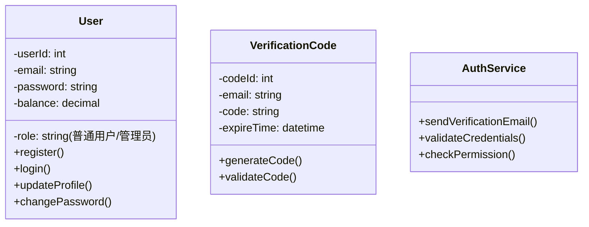
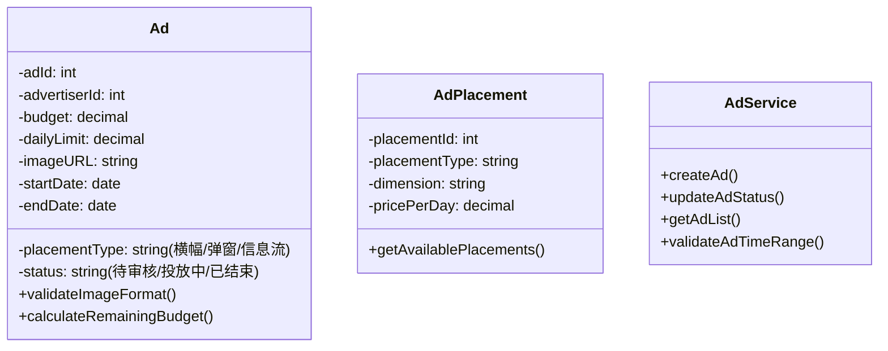
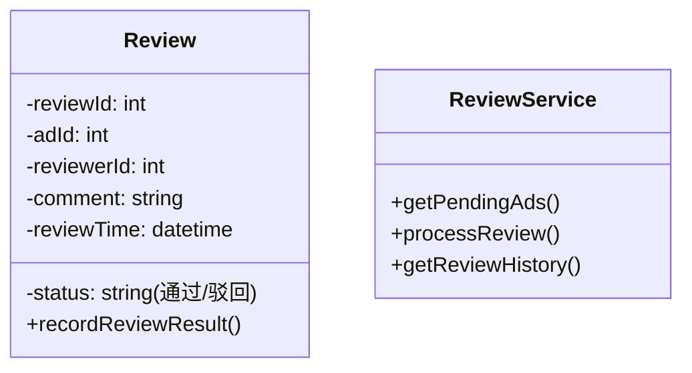
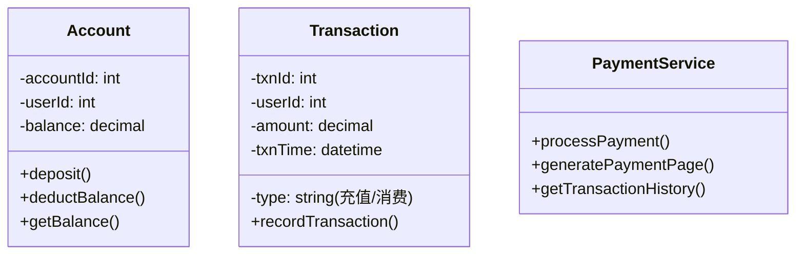
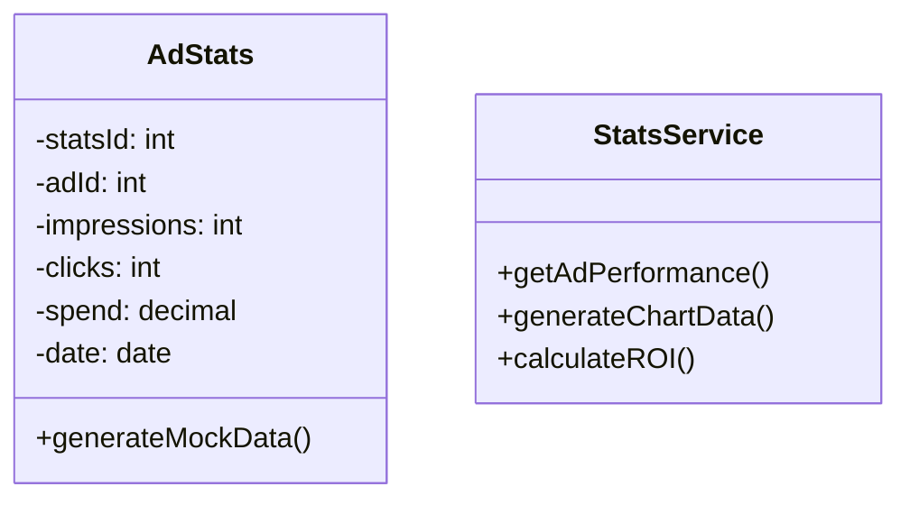
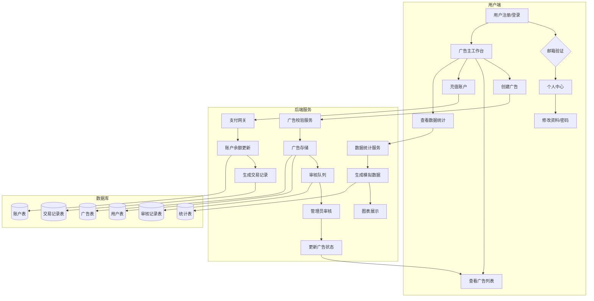
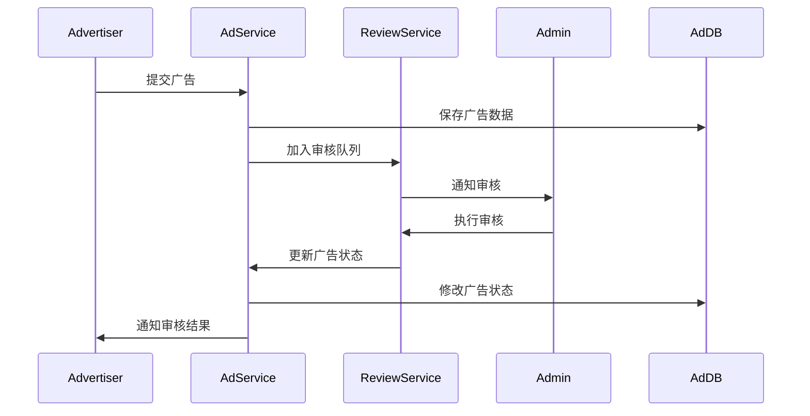
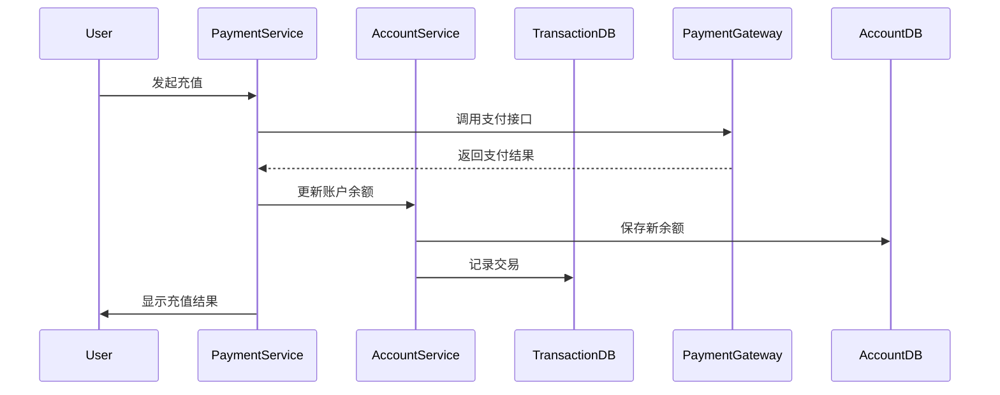
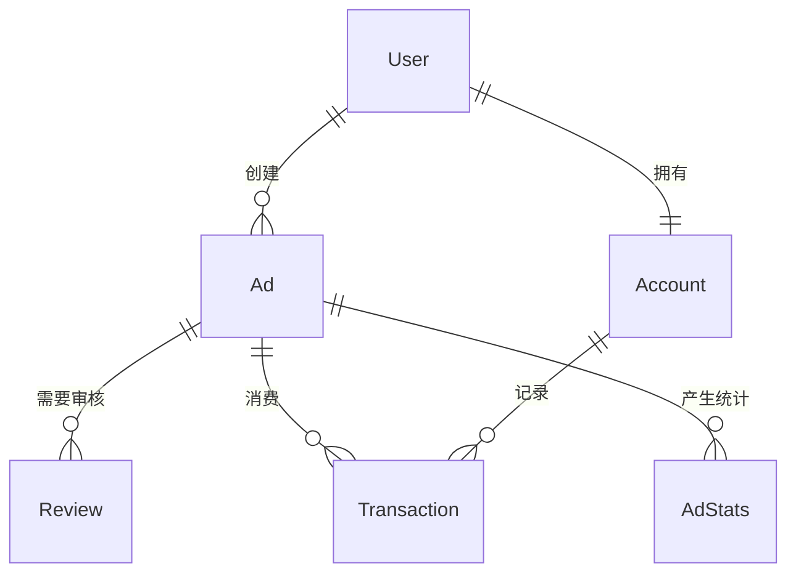

以下是对广告系统的类分析和数据流图分析：

### 一、类分析（Class Diagram）

#### 1. 用户模块类

#### 2. 广告投放模块类

#### 3. 审核模块类

#### 4. 支付模块类

#### 5. 数据统计模块类

### 二、数据流图（Data Flow Diagram）

### 三、关键交互流程

1. **广告审核流程**

2. **支付充值流程**

### 四、数据库关系图

### 五、核心设计要点
1. **权限控制**：通过Role-Based Access Control（RBAC）实现不同角色的访问权限
2. **状态机设计**：广告状态迁移（待审核→投放中→已结束）
3. **数据一致性**：使用数据库事务保证充值操作中账户余额和交易记录的一致性
4. **数据模拟**：通过定时任务生成模拟曝光/点击数据
5. **文件存储**：广告图片使用对象存储服务（如AWS S3），数据库保存URL路径

该设计实现了模块间的松耦合，通过服务层进行业务逻辑封装，数据库采用规范化的表结构设计，同时通过数据流图清晰地展示了系统各组件间的交互关系。